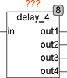

<!--
  Copyright (c) 2026 Hans Mühlbauer, Franz Höpfinger and others.

  This program and the accompanying materials are made available under the
  terms of the Eclipse Public License 2.0 which is available at
  https://www.eclipse.org/legal/epl-2.0

  SPDX-License-Identifier: EPL-2.0
-->

## Type	Function module

| | |
|:---|:---|
| **Input	IN** | REAL (input value) |
| **Output	OUT1** | REAL (by 1 cycle delayed output value) |
| **OUT2** | REAL (by 2 cycles delayed output value) |
| **OUT3** | REAL (by 3 cycles delayed output value) |
| **OUT4** | REAL (by 4 cycles delayed output value) |
| | DELAY_4 delays an input signal by a maximum of 4 cycles. The outputs Out 1..4 passes the last 4 values. Out1 is delayed by one cycle, Qut2 by 2 cycles and Out3  by 3 cycles and Out4 by 4 cycles. |

**Example:**

Example  :
