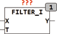

<!--
  Copyright (c) 2026 Hans Mühlbauer, Franz Höpfinger and others.

  This program and the accompanying materials are made available under the
  terms of the Eclipse Public License 2.0 which is available at
  https://www.eclipse.org/legal/epl-2.0

  SPDX-License-Identifier: EPL-2.0
-->

## FILTER_I

| | |
|:---|:---|
| **Type	Function** | INT |
| **Input	X** | INT (input) |
| **T** | TIME (time constant of the filter) |
| **Output	Y** | INT (filtered value) |
| | FILTER_I is a filter of the first degree for 16-bit INT data. The main application is the filtering of sensor signals for noise reduction. The basic functionality of a filter of the first degree can be found in the module FT_PT1. |

