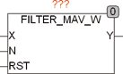

<!--
  Copyright (c) 2026 Hans Mühlbauer, Franz Höpfinger and others.

  This program and the accompanying materials are made available under the
  terms of the Eclipse Public License 2.0 which is available at
  https://www.eclipse.org/legal/epl-2.0

  SPDX-License-Identifier: EPL-2.0
-->

## Type	Function: WORD

| | |
|:---|:---|
| **Input	X** | WORD (input) |
| **N** | UINT (number of assigned values) |
| **RST** | BOOL (asynchronous reset input) |
| **Output	Y** | WORD (filtered value) |
| | FILTER_MAV_W is a filter with moving average. The filter with moving average (also  Moving  Average  Filter called) the average of N successive readings is output as an average. |
| **Y** | = (X0 + X1 + … + Xn-1) / N |
| | X0 is the value of X in the current cycle, X1 is the value in the previous cycle, etc. The number of values over which the average has to be calculated is specified at the input N. The range of values of N is between 1 and 32 |

