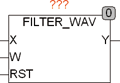

<!--
  Copyright (c) 2026 Hans Mühlbauer, Franz Höpfinger and others.

  This program and the accompanying materials are made available under the
  terms of the Eclipse Public License 2.0 which is available at
  https://www.eclipse.org/legal/epl-2.0

  SPDX-License-Identifier: EPL-2.0
-->

## Type	Function: REAL

| | |
|:---|:---|
| **Input	X** | DWORD (input) |
| **W** | array [0...15] of real (weighting factors) |
| **RST** | BOOL (asynchronous reset input) |
| **Output	Y** | REAL (filtered value) |
| | FILTER_WAV is a filter with a weighted average. (Also called FIR filter) the filter with a weighted average of individual values in the buffer are evaluated with different weights. |
| **Y** | = X0 * W0 + X1 * W1 + ….+ X15 * W15 |
| | X0 is the value of X in the current cycle, X1 is the value in the previous cycle, etc. The factors W are passed as the input array W. In applying the FIR filter hast to be ensured that appropriate factors are used for weighting. The application makes sense only if these factors are determined by appropriate methods or design software. |

