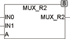

<!--
  Copyright (c) 2026 Hans Mühlbauer, Franz Höpfinger and others.

  This program and the accompanying materials are made available under the
  terms of the Eclipse Public License 2.0 which is available at
  https://www.eclipse.org/legal/epl-2.0

  SPDX-License-Identifier: EPL-2.0
-->

## MUX_R2

| | |
|:---|:---|
| **Type** | Function |
| **Input	IN0** | REAL (input 0) |
| **IN1** | REAL (input value of 1) |
| **A** | BOOL (address input) |
| **Output** | REAL (IN0 if A = 0, IN1 if A = 1) |
| | MUX_R2 selects one of two input values. The function returns the value of IN0, if A = 0 and the value of IN1, if A = 1 |

