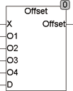
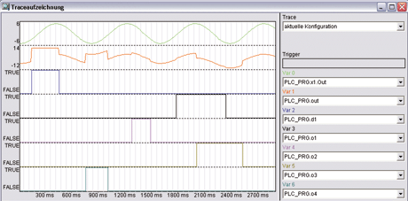

<!--
  Copyright (c) 2026 Hans Mühlbauer, Franz Höpfinger and others.

  This program and the accompanying materials are made available under the
  terms of the Eclipse Public License 2.0 which is available at
  https://www.eclipse.org/legal/epl-2.0

  SPDX-License-Identifier: EPL-2.0
-->

## OFFSET

| | |
|:---|:---|
| **Type** | Function |
| **Input	X** | REAL (input) |
| **O1** | BOOL (  Enable  Offset 1) |
| **O2** | BOOL (Enable Offset 2) |
| **O3** | BOOL (Enable Offset 3) |
| **D** | BOOL (EnableDefault) |
| **Output** | REAL (output value with offset) |
| **Setup	Offset_1** | REAL (offset that is added when O1 = TRUE) |
| **Offset_2** | REAL (offset that is added when O2 = TRUE) |
| **Offset_3** | REAL (offset that is added when O3 = TRUE) |
| **Offset_4** | REAL (offset is added if O4 = TRUE) |
| **Default** | REAL (This is used instead of X, if D = TRUE) |
| | The  function  Offset  addes  different offsets to an input signal depending on the binary value of O1.. O4.   The offsets can be added individually or   simultaneously. With the input D a Default  value instead of the input X can be switched to the adder. The offset and  Default value  be defined through the setup variables. |
| **The following example illustrates the operation of offset** |  |

