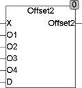

<!--
  Copyright (c) 2026 Hans Mühlbauer, Franz Höpfinger and others.

  This program and the accompanying materials are made available under the
  terms of the Eclipse Public License 2.0 which is available at
  https://www.eclipse.org/legal/epl-2.0

  SPDX-License-Identifier: EPL-2.0
-->

## OFFSET2

| | |
|:---|:---|
| **Type** | Function |
| **Input	X** | REAL (input) |
| **O1** | REAL (Enable Offset 1) |
| **O2** | REAL (Enable Offset 2) |
| **O3** | REAL (Enable Offset 3) |
| **D** | BOOL (EnableDefault) |
| **Output** | REAL (output value with offset) |
| **Setup	Offset_1** | REAL (offset that is added when O1 = TRUE) |
| **Offset_2** | REAL (offset that is added when O2 = TRUE) |
| **Offset_3** | REAL (offset that is added when O3 = TRUE) |
| **Offset_4** | REAL (offset is added if O4 = TRUE) |
| **DEFAULT** | REAL (This is used instead of X, if true) |
| | The function Offset2 adds an offset to an input signal depending on the binary value of O1.. O4.   If more offsets are selected simultaneously, then the offset with the highest numbers added up and the others ignored. If O1 and O3 are simultaneously TRUE, then Offset_3 is added and not Offset_1. With the input D a  default  value instead of the input X can be switched to the adder. The offset and  Default value  be defined through the setup variables. |
| | For further explanation and an example, see Offset, which has very similar functionality. Offset2 only adds only one (the one with the highest number) offset, while Ofset simultaneously adding all the selected. |

