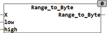

<!--
  Copyright (c) 2026 Hans Mühlbauer, Franz Höpfinger and others.

  This program and the accompanying materials are made available under the
  terms of the Eclipse Public License 2.0 which is available at
  https://www.eclipse.org/legal/epl-2.0

  SPDX-License-Identifier: EPL-2.0
-->

## RANGE_TO_BYTE

| | |
|:---|:---|
| **Type** | Function |
| **Input	X** | REAL (input) |
| **LOW** | REAL  (Lower  Range limit  ) |
| **HIGH** | REAL (upper limit) |
| **Output** | BYTE (output value) |
| | RANGE_TO_BYTE converts a real value in a BYTE value. An input value of X corresponds to the value of LOW is converted it into an output value of 0 and an input value X of the input value corresponds to HIGH is converted into an output value of 255. The input X is limited to the range from LOW to HIGH, an overflow of the output BYTE can   therefore not happen. |

