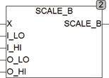

<!--
  Copyright (c) 2026 Hans Mühlbauer, Franz Höpfinger and others.

  This program and the accompanying materials are made available under the
  terms of the Eclipse Public License 2.0 which is available at
  https://www.eclipse.org/legal/epl-2.0

  SPDX-License-Identifier: EPL-2.0
-->

## SCALE_B

| | |
|:---|:---|
| **Type	Function** | REAL |
| **Input	X** | DWORD (input) |
| **I_LO** | DWORD (min input value) |
| **I_HI** | DWORD (max input value) |
| **O_LO** | REAL (min output value) |
| **O_HI** | REAL (output value max) |
| **Output** | REAL (output value) |
| | SCALE_B scales an input value BYTE and calculates an output value in REAL. The input value X is limited here to I_LO and I_HI. SCALE_D (IN, 0, 255, 0, 100) scales an input with 8-bit resolution on the output 0..100. |

