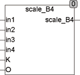

<!--
  Copyright (c) 2026 Hans Mühlbauer, Franz Höpfinger and others.

  This program and the accompanying materials are made available under the
  terms of the Eclipse Public License 2.0 which is available at
  https://www.eclipse.org/legal/epl-2.0

  SPDX-License-Identifier: EPL-2.0
-->

## SCALE  _  B4

| | |
|:---|:---|
| **Type	Function** | REAL |
| **Input	IN1 .. IN4** | Byte (input values) |
| **K** | REAL (multiplier) |
| **O** | REAL (offset) |
| **Output** | REAL (output value) |
| **Setup	IN1_MIN** | REAL (lowest value for IN1) |
| **IN1_MAX** | REAL (highest value for IN1) |
| **IN2_MIN** | REAL (lowest value for IN2) |
| **IN2_MAX** | REAL (highest value for IN2) |
| **IN3_MIN** | REAL (lowest value for IN3) |
| **IN3_MAX** | REAL (highest value for IN3) |
| **IN4_MIN** | REAL (lowest value for IN4) |
| **IN4_MAX** | REAL (highest value for IN4) |
| | SCALE_B4 calculates from the input values IN and the setup values IN_MIN and IN_MAX internal values, then add all the internal values, multiplies the sum by K and add the offset O. An input value IN = 0 means IN_MIN is included, IN = 255 means IN_MAX is not considered. If K is not connected, then the multiplier is 1 |
| **OUT** | = (in1 * (IN1_MAX – IN1_MIN) / 255 + IN1_MIN |
| | + in2 * (IN2_MAX – IN2_MIN) / 255 + IN2_MIN |
| | + in3 * (IN3_MAX – IN3_MIN) / 255 + IN3_MIN |
| | + in4 * (IN4_MAX – IN4_MIN) / 255 + IN4_MIN) * K + O |
| | SCALE_B4  can  ie be used for calculation total air quantities in ventilation systems, or wherever controlled mixers are used and the resulting total needs to be calculated.. More detailed explanations you can find at SCALE_B2. |

