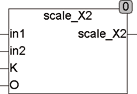
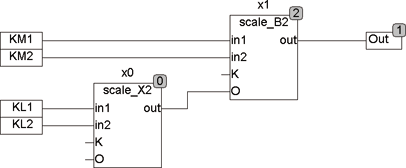

<!--
  Copyright (c) 2026 Hans Mühlbauer, Franz Höpfinger and others.

  This program and the accompanying materials are made available under the
  terms of the Eclipse Public License 2.0 which is available at
  https://www.eclipse.org/legal/epl-2.0

  SPDX-License-Identifier: EPL-2.0
-->

## SCALE_X2

| | |
|:---|:---|
| **Type** | Function |
| **Input	IN1 .. 2** | BOOL (input values) |
| **K** | REAL (multiplier) |
| **O** | REAL (offset) |
| **Output** | REAL (output value) |
| **Setup	IN_MIN** | REAL (lowest value for IN) |
| **IN_MAX** | REAL (highest value for IN) |
| | SCALE_X2 calculates from the input values IN and the setup values IN_MIN and IN_MAX internal values, then add all the internal values, multiplies the sum by K and add the offset O. An input value IN = FALSE means IN_MIN is included, IN = TRUE means IN_MAX is considered. The sum is multiplied by K and offset O is added. K is not connected then the first multiplier |
| | SCALE_X2 can be used, for example, to calculate total air quantities in ventilation systems, or wherever controlled flaps are used and the resulting total needs to be calculated. By the input offset, SCALE_X2 can easily be cascaded with other SCALE modules. |
| | In  following  Example, two motor flaps KM1 and km² with 2 on/off flaps are connected KL1 and KL2 and the resulting amount of air is calculated. |

