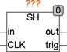
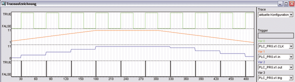

<!--
  Copyright (c) 2026 Hans Mühlbauer, Franz Höpfinger and others.

  This program and the accompanying materials are made available under the
  terms of the Eclipse Public License 2.0 which is available at
  https://www.eclipse.org/legal/epl-2.0

  SPDX-License-Identifier: EPL-2.0
-->

## SH

| | |
|:---|:---|
| **Type** | Function module |
| **Input	IN** | REAL (input signal) |
| **CLK** | BOOL (clock input) |
| **Output	OUT_MAX** | REAL (upper output limit) |
| **TRIG** | BOOL ( Trigger Output) |
| | SH is a Sample and Hold module. It saves on each rising edge of CLK, the input signal IN at the output OUT. After each update of TRIG OUT is TRUE for one cycle. |
| **The following Example explains the function of SH** |  |

