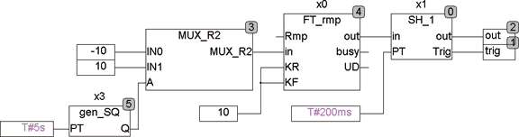

<!--
  Copyright (c) 2026 Hans Mühlbauer, Franz Höpfinger and others.

  This program and the accompanying materials are made available under the
  terms of the Eclipse Public License 2.0 which is available at
  https://www.eclipse.org/legal/epl-2.0

  SPDX-License-Identifier: EPL-2.0
-->

## SH_1

| | |
|:---|:---|
| **Type** | Function module |
| **Input	IN** | REAL (input signal) |
| **PT** | TIME (sampling time) |
| **Output	OUT_MAX** | REAL (upper output limit) |
| **TRIG** | BOOL ( Trigger Output) |
| | SH_1 is a Sample and Hold module with adjustable sampling time. It stores all the PT, the input signal IN at the output OUT. After each update of OUT, TRIG remains TRUE for one cycle. |
| **The following Example illustrates how SH_1 works** |  |

