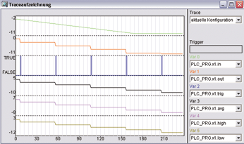

<!--
  Copyright (c) 2026 Hans Mühlbauer, Franz Höpfinger and others.

  This program and the accompanying materials are made available under the
  terms of the Eclipse Public License 2.0 which is available at
  https://www.eclipse.org/legal/epl-2.0

  SPDX-License-Identifier: EPL-2.0
-->

## SH_2

| | |
|:---|:---|
| **Type** | Function module |
| **Input	IN** | REAL (input signal) |
| **PT** | TIME (sampling time) |
| **N** | INT (number of Samples of Statistics) |
| **DISC** | INT (discard DISC values) |
| **Output	OUT_MAX** | REAL (upper output limit) |
| **TRIG** | BOOL ( Trigger Output) |
| **AVG** | REAL (average) |
| **HIGH** | REAL (maximum) |
| **LOW** | REAL (minimum) |
| | SH_2 is a Sample and Hold module with adjustable sampling time. It stores all the PT, the input signal IN at the output OUT. After each update of OUT, TRIG remains TRUE for one cycle. In addition to the function of a Sample and Hold module SH_2 already offers integrated functionality with respect to the statistics. With the input of N can be specified on how many Samples (16 maximum), a average, minimum and maximum value can be formed. As a further feature, from N Samples smallest and largest values can be ignored for statistics, which can be very useful to ignore extremes. The input value DISC = 0 means use all Samples , a 1 means ignore the lowest value, 2 means ignore the lowest and highest value etc. For example, if N = 5 and DISC = 2, then 5 Samples are collected, the lowest and highest value are discarded and on the remaining 3 Samples the average, minimum and maximum value is formed. |
| **The following example illustrates how SH_2 works** |  |

