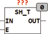
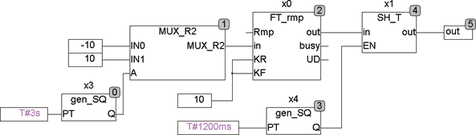

<!--
  Copyright (c) 2026 Hans Mühlbauer, Franz Höpfinger and others.

  This program and the accompanying materials are made available under the
  terms of the Eclipse Public License 2.0 which is available at
  https://www.eclipse.org/legal/epl-2.0

  SPDX-License-Identifier: EPL-2.0
-->

## SH_T

| | |
|:---|:---|
| **Type** | Function module |
| **Input	IN** | REAL (input signal) |
| **E** | BOOL ( enable Signal) |
| **Output	OUT_MAX** | REAL (upper output limit) |
| | SH_T is a transparent Sample and Hold module. The input signal is provided at the output, as long as E is TRUE. With a falling edge of E, the value stored in the output OUT and will stay here until E return TRUE, and thus is switched back to OUT. |
| | The following example illustrates the operation of SH_T |

