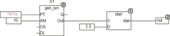

<!--
  Copyright (c) 2026 Hans Mühlbauer, Franz Höpfinger and others.

  This program and the accompanying materials are made available under the
  terms of the Eclipse Public License 2.0 which is available at
  https://www.eclipse.org/legal/epl-2.0

  SPDX-License-Identifier: EPL-2.0
-->

## Type	Function

| | |
|:---|:---|
| **Input	X** | REAL (input) |
| **D** | REAL (step size of the output signal) |
| **Output** | REAL (output) |
| | The  Output  of  STAIR  follows the input signal X with a step function. The height of the steps is given by D. If X = 0, then the output directly follows the input signal. STAIR is not suitable for filtering of input signals, because if the input  fluctuates by a step , the output switches between two adjacent values back and forth. For this purpose we recommend the use of Stair2 that works with a  Hysteresis   and avoids unstable conditions. |
| **The following example illustrates the operation of STAIR** |  |

