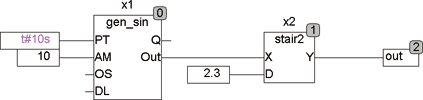
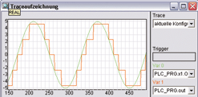

<!--
  Copyright (c) 2026 Hans Mühlbauer, Franz Höpfinger and others.

  This program and the accompanying materials are made available under the
  terms of the Eclipse Public License 2.0 which is available at
  https://www.eclipse.org/legal/epl-2.0

  SPDX-License-Identifier: EPL-2.0
-->

## STAIR2

| | |
|:---|:---|
| **Type** | Function module |
| **Input	X** | REAL (input) |
| **D** | REAL (step size of the output signal) |
| **Output	Y** | REAL (output signal) |
| | The output signal from STAIR2 follows the input signal X with a step function. The height of the steps is given by D. If D = 0, then the output directly follows the input signal. The signal follows the steps but with a hysteresis of D so that a noisy input signal can not trigger jumps between step values. STAIR2 is also suitable as an input filter. |
| **The following example illustrates the operation of STAIR2** |  |

