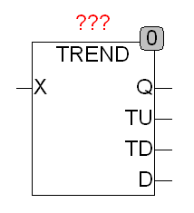

<!--
  Copyright (c) 2026 Hans Mühlbauer, Franz Höpfinger and others.

  This program and the accompanying materials are made available under the
  terms of the Eclipse Public License 2.0 which is available at
  https://www.eclipse.org/legal/epl-2.0

  SPDX-License-Identifier: EPL-2.0
-->

## TREND

| | |
|:---|:---|
| **Type** | Function module |
| **Input	X** | REAL (input) |
| **Output	Q** | BOOL (X ascending = TRUE) |
| **TU** | BOOL (TRUE if the input X increases) |
| **TD** | BOOL (TRUE if input X reduces) |
| **D** | REAL (deltas of the input change) |
| | TREND monitors the input X and time at the output Q to see if X increases (Q = TRUE) or X decrease (Q = FALSE). If X does not change, Q remains at its last value. If X increases, the output TU gets for one cycle to TRUE and at the output D the result X - LAST_X is displayed. If X is less than LAST_X so TD gets TRUE for one cycle and the output D is LAST_X  - X passed. LAST_X is an internal value of the module and is the value of X in the last cycle. |

