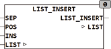

<!--
  Copyright (c) 2026 Hans Mühlbauer, Franz Höpfinger and others.

  This program and the accompanying materials are made available under the
  terms of the Eclipse Public License 2.0 which is available at
  https://www.eclipse.org/legal/epl-2.0

  SPDX-License-Identifier: EPL-2.0
-->

## LIST_INSERT

| | |
|:---|:---|
| **Type	Function** | BOOL |
| **Input	SEP** | BYTE (separation sign the list) |
| **POS** | INT (position of list element) |
| **INS** | STRING (New Item) |
| **I / O	LIST** | STRING(LIST_LENGTH) (input list) |
| **Output** | BOOL (TRUE) |
| | LIST_INSERT puts an element at the position POS in a list. The list consists of  Strings (elements) that begin with the separation character SEP. The first element of the list is at position 1. If a position greater than the last element of the list is given, empty elements are added to the list until INS is at its normal position at the end of the list. If POS = 0, the new element will be placed to the top of the list. |



**Example:**

```iecst
LIST_INSERT('&ABC&23&&NEXT',38,0,'NEW')= '&NEW&ABC&23&&NEXT' LIST_INSERT('&ABC&23&&NEXT',38,1,'NEW')= '&NEW&ABC&23&&NEXT' LIST_INSERT('&ABC&23&&NEXT',38,3,'NEW')= '&ABC&23&NEW&&NEXT' LIST_INSERT('&ABC&23&&NEXT',38,6,'NEW')= '&ABC&23&&NEXT&&NEW'
```
