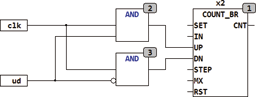

<!--
  Copyright (c) 2026 Hans Mühlbauer, Franz Höpfinger and others.

  This program and the accompanying materials are made available under the
  terms of the Eclipse Public License 2.0 which is available at
  https://www.eclipse.org/legal/epl-2.0

  SPDX-License-Identifier: EPL-2.0
-->

## COUNT_DR

| | |
|:---|:---|
| **Type** | Function module |
| **Input	SET** | BOOL (Asynchronous Set) |
| **IN** | DWORD (default value for set) |
| **UP** | BOOL (forward switch edge-triggered) |
| **DN** | BOOL (reverse switch edge-triggered) |
| **STEP** | DWORD (increment of Counters) |
| **MX** | DWORD (maximum value of the Counters) |
| **RST** | BOOL (asynchronous reset) |
| **Output	CNT** | DWORD (output) |
| | COUNT_DR is a DWORD (32-bit) counter with counts from 0 to MX and then begins again at 0. The counter can, using two edge-triggered inputs UP and DN, both forward and backward counting. when reaching a final value 0 or MX it counts again at 0 or MX. The STEP input sets the increment value of the counter. With a TRUE at input SET the counter is set to present value at the IN input. A reset input RST resets the counter at any time to 0. |
| **If the independent inputs UP and DN with CLK and a control input UP/DN should be replaced, id can be done using two AND gates at the inputs** |  |

|  | SET | IN | UP | DN | STEP | RST | CNT |
| --- | --- | --- | --- | --- | --- | --- | --- |
| Reset | - | - | - | - | - | 1 | 0 |
| Set | 1 | N | - | - | - | 0 | N |
| up | 0 | - | ↑ | 0 | N | 0 | CNT + N |
| down | 0 | - | 0 | ↑ | N | 0 | CNT - N |
