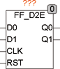

<!--
  Copyright (c) 2026 Hans Mühlbauer, Franz Höpfinger and others.

  This program and the accompanying materials are made available under the
  terms of the Eclipse Public License 2.0 which is available at
  https://www.eclipse.org/legal/epl-2.0

  SPDX-License-Identifier: EPL-2.0
-->

## Type	Function module

| | |
|:---|:---|
| **Input	D0** | BOOL (Data 0 in) |
| **D1** | BOOL (Data 1 in) |
| **CLK** | BOOL (clock input) |
| **RST** | BOOL (asynchronous reset) |
| **Output	Q0** | BOOL (Data 0 out) |
| **Q1** | BOOL (Data 1 out) |
| | FF_D2E is a 2-bit edge-triggered D-Flip-Flop with asynchronous reset input. The D-Flip-Flop stores the values at the input D at a rising edge at the CLK input. |
| | D1D0CLKRSTQ1Q0 |

