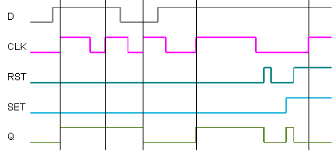

<!--
  Copyright (c) 2026 Hans Mühlbauer, Franz Höpfinger and others.

  This program and the accompanying materials are made available under the
  terms of the Eclipse Public License 2.0 which is available at
  https://www.eclipse.org/legal/epl-2.0

  SPDX-License-Identifier: EPL-2.0
-->

## Type	Function module

| | |
|:---|:---|
| **Input	SET** | BOOL (Asynchronous Set) |
| **D** | BOOL (Data in) |
| **CLK** | BOOL (clock input) |
| **RST** | BOOL (asynchronous reset) |
| **Output	Q** | BOOL (Data Out) |
| | FF_DRE is a edge-triggered D-Flip-Flop with Asynchronous Set and Reset input. A rising edge at CLK stores the input D to output Q. A TRUE on the SET or RST input resets or clears the output Q at any time regardless of CLK. The reset input has priority over the input set. If both are active (TRUE) are reset is processed and SET is ignored. |

