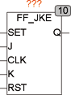

<!--
  Copyright (c) 2026 Hans Mühlbauer, Franz Höpfinger and others.

  This program and the accompanying materials are made available under the
  terms of the Eclipse Public License 2.0 which is available at
  https://www.eclipse.org/legal/epl-2.0

  SPDX-License-Identifier: EPL-2.0
-->

## Type	Function module

| | |
|:---|:---|
| **Input	SET** | BOOL (Asynchronous Set) |
| **J** | BOOL (clock synchronous Set) |
| **CLK** | BOOL (clock input) |
| **K** | BOOL (clock synchronous reset) |
| **RST** | BOOL (asynchronous reset) |
| **Output	Q** | BOOL (output) |
| | FF_JKE is an edge-triggered JK-flop-flop with asynchronous Set and Reset inputs. The JK-Flip-Flop sets the output Q when with a rising edge of the CLK the Input  J is TRUE. Q is FALSE when on a rising clock edge the input K is TRUE. If the two inputs J and K on a rising clock edge are TRUE, the output will be negated. It switches the output signal in each cycle. |
| | DCLKRSTQSET |

