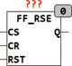

<!--
  Copyright (c) 2026 Hans Mühlbauer, Franz Höpfinger and others.

  This program and the accompanying materials are made available under the
  terms of the Eclipse Public License 2.0 which is available at
  https://www.eclipse.org/legal/epl-2.0

  SPDX-License-Identifier: EPL-2.0
-->

## Type	Function module

| | |
|:---|:---|
| **Input	CS** | BOOL (edge-sensitive Set) |
| **CR** | BOOL (edge-sensitive reset) |
| **RST** | BOOL (asynchronous reset) |
| **Output	Q** | BOOL (output) |
| | FF_RSE an edge-triggered RS flip-flop. The output Q is set by a rising edge of CS and cleared by a rising edge on CR. If both edges (CS and CR) rise at the same time, the output is set to FALSE. An asynchronous reset input RST sets the output at any time to FALSE. |

