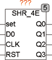
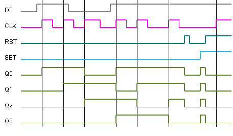

<!--
  Copyright (c) 2026 Hans Mühlbauer, Franz Höpfinger and others.

  This program and the accompanying materials are made available under the
  terms of the Eclipse Public License 2.0 which is available at
  https://www.eclipse.org/legal/epl-2.0

  SPDX-License-Identifier: EPL-2.0
-->

## Type	Function module

| | |
|:---|:---|
| **Input	SET** | BOOL (Asynchronous Set) |
| **D0** | BOOL (Data Input) |
| **CLK** | BOOL (clock input) |
| **RST** | BOOL (asynchronous reset) |
| **Output	Q0** | BOOL (Data  Out  0) |
| **Q1** | BOOL (Data  Out  1) |
| **Q1** | BOOL (Data  Out  1) |
| **Q3** | BOOL (Data  Out  3) |
| | SHR_4E is a 4-bit shift register with asynchronous set and reset input. A rising edge at CLK, Q2 is moved to Q3, then moves the Q1 to Q2, Q0 to Q1 and D0 to Q0. With a TRUE on the Set input, all outputs (Q0.. Q3) are set to TRUE and with RST are all set to FALSE. |

