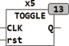

<!--
  Copyright (c) 2026 Hans Mühlbauer, Franz Höpfinger and others.

  This program and the accompanying materials are made available under the
  terms of the Eclipse Public License 2.0 which is available at
  https://www.eclipse.org/legal/epl-2.0

  SPDX-License-Identifier: EPL-2.0
-->

## TOGGLE

| | |
|:---|:---|
| **Type** | Function module |
| **Input	CLK** | BOOL (clock input) |
| **RST** | BOOL (asynchronous reset) |
| **Output	Q** | BOOL (output) |
| | TOGGLE is a  edge-triggered  Toggle  Flip  -Flop with asynchronous reset input. The TOGGLE  Flip  Flop invertes output Q on a rising edge of CLK. The output changes on each rising edge of CLK his condition. |

