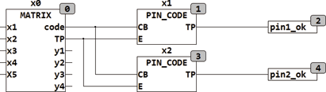

<!--
  Copyright (c) 2026 Hans Mühlbauer, Franz Höpfinger and others.

  This program and the accompanying materials are made available under the
  terms of the Eclipse Public License 2.0 which is available at
  https://www.eclipse.org/legal/epl-2.0

  SPDX-License-Identifier: EPL-2.0
-->

## PIN_CODE

| | |
|:---|:---|
| **Type** | Function module |
| **Input	CB** | BYTE (input) |
| **E** | BOOL (  Enable Input) |
| **Output** | TP (  Trigger  Output) |
| | PIN_CODE checks a stream of bytes for the presence of a specific sequence. If the sequence is found, this is indicated by a TRUE at output TP. |
| | In the following example, two modules PIN_CODE be used to decode two CODE_SEQUENCES of a matrix keyboard. |
| **SETUP	PIN** | STRING(8) (String to be tested  ) |

