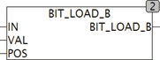

<!--
  Copyright (c) 2026 Hans Mühlbauer, Franz Höpfinger and others.

  This program and the accompanying materials are made available under the
  terms of the Eclipse Public License 2.0 which is available at
  https://www.eclipse.org/legal/epl-2.0

  SPDX-License-Identifier: EPL-2.0
-->

## Type	Function: BYTE

| | |
|:---|:---|
| **Input	IN** | BYTE (input) |
| **VAL** | BOOL (value of bits to be loaded) |
| **POS** | INT (position of the bits to be loaded) |
| **Output** | BYTE (output) |
| | BIT_LOAD_B copies the bit at VAL to the bit in the position N in byte IN. The least significant bit B0 is described by the position 0. |

