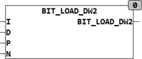

<!--
  Copyright (c) 2026 Hans Mühlbauer, Franz Höpfinger and others.

  This program and the accompanying materials are made available under the
  terms of the Eclipse Public License 2.0 which is available at
  https://www.eclipse.org/legal/epl-2.0

  SPDX-License-Identifier: EPL-2.0
-->

## Type	Function: DWORD

| | |
|:---|:---|
| **Input	I** | DWORD (input value) |
| **D** | BOOL (value of bits to be loaded) |
| **P** | INT (position of the bits to be loaded) |
| **N** | INT (number of bits that are loaded from position P) |
| **Output** | DWORD (output) |
| | BIT_LOAD_DW2 can set or delete multiple bits in a byte at the same time. The position is indicated with 0 for Bit0 and 31 for Bit 31. N specifies how many bits from the specified location can be changed. If N = 0, no bits are changed. If P and N is specified that the bits to be written goes over the highest bit (bit 31), so it starts again at bit 0. |

**Example:**

Examples, see BIT_LOAD_B2
