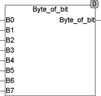

<!--
  Copyright (c) 2026 Hans Mühlbauer, Franz Höpfinger and others.

  This program and the accompanying materials are made available under the
  terms of the Eclipse Public License 2.0 which is available at
  https://www.eclipse.org/legal/epl-2.0

  SPDX-License-Identifier: EPL-2.0
-->

## Type	Function: BYTE

| | |
|:---|:---|
| **Input	B0 .. B7** | BOOL (input bits) |
| **Output** | BYTE (output byte) |
| | BYTE_OF_BIT uses one byte of 8 individual bits (B0 .. B7) together. |

