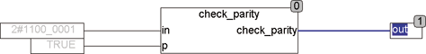
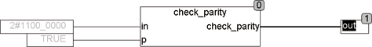

<!--
  Copyright (c) 2026 Hans Mühlbauer, Franz Höpfinger and others.

  This program and the accompanying materials are made available under the
  terms of the Eclipse Public License 2.0 which is available at
  https://www.eclipse.org/legal/epl-2.0

  SPDX-License-Identifier: EPL-2.0
-->

## CHECK_PARITY

| | |
|:---|:---|
| **Type	Function** | BOOL |
| **Input	IN** | BYTE (input byte) |
| **P** | BOOL ( Parity-Bit) |
| **Output** | BYTE (output is TRUE in even parity) |
| | CHECK_PARITY checks an input byte IN and an associated paritybit P to even parity. The output is TRUE if the number of bits in the byte IN have the value TRUE together with the parity-bit results is an even number. |

**Example:**

Example for output = TRUE: Example output = FALSE:
