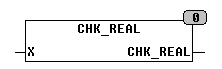

<!--
  Copyright (c) 2026 Hans Mühlbauer, Franz Höpfinger and others.

  This program and the accompanying materials are made available under the
  terms of the Eclipse Public License 2.0 which is available at
  https://www.eclipse.org/legal/epl-2.0

  SPDX-License-Identifier: EPL-2.0
-->

## CHK_REAL

| | |
|:---|:---|
| **Type	Function** | BYTE |
| **Input	X** | REAL (value to be tested) |
| **Output** | BYTE (return value) |
| | CHK_REAL reviewes X for valid values. |
| **The return values are** |  |
| **#00** | valid floating-point |
| **#20** | + Infinity |
| **#40** | - Infinity |
| **#80** | NAN |
| | For more information see the IEEE754 floating point specification. |

