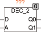
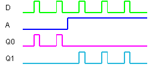

<!--
  Copyright (c) 2026 Hans Mühlbauer, Franz Höpfinger and others.

  This program and the accompanying materials are made available under the
  terms of the Eclipse Public License 2.0 which is available at
  https://www.eclipse.org/legal/epl-2.0

  SPDX-License-Identifier: EPL-2.0
-->

## Type	Function module

| | |
|:---|:---|
| **Input	D** | BOOL (input bit) |
| **A** | BOOL (address) |
| **Output	Q0** | BOOL (TRUE if A=0) |
| **Q1** | BOOL (TRUE if A=1) |
| | DEC_2 is a 2-bit decoder module. If A=0, the input D is passed to output Q0. If A=1, so D is set to Q1. In other words, Q0=1 if D=1 and A=0 |
| **Logical connection** | Q0 = D & /A; Q1 = D & A |

