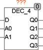
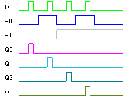

<!--
  Copyright (c) 2026 Hans Mühlbauer, Franz Höpfinger and others.

  This program and the accompanying materials are made available under the
  terms of the Eclipse Public License 2.0 which is available at
  https://www.eclipse.org/legal/epl-2.0

  SPDX-License-Identifier: EPL-2.0
-->

## Type	Function module

| | |
|:---|:---|
| **Input	D** | BOOL (input bit) |
| **A0** | BOOL (address bit0) |
| **A1** | BOOL (address bit1) |
| **Output	Q0** | BOOL (TRUE with A0=0 and A1=0) |
| **Q1** | BOOL (TRUE if A0=1 and A1=0) |
| **Q2** | BOOL (true when A0=0 and A1=1) |
| **Q2** | BOOL (true when A0=0 and A1=1) |
| | DEC_4 is a 4-bit decoder module. If A0=0 and A1=0, the input D is passed to output Q0. If A0=1 and A1=1, the input D is passed to output Q3. In other words, Q0=1, if D=1 and A0=0 and A1=0. |
| **Logical connection** | Q0 = D & / A0 & / A1 |
| | Q1 = D & A0 & /A1 |
| | Q2 = D & /A0 & A1 |
| | Q3 = D & A0 & A1 |

