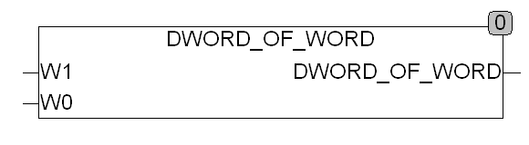

<!--
  Copyright (c) 2026 Hans Mühlbauer, Franz Höpfinger and others.

  This program and the accompanying materials are made available under the
  terms of the Eclipse Public License 2.0 which is available at
  https://www.eclipse.org/legal/epl-2.0

  SPDX-License-Identifier: EPL-2.0
-->

## DWORD_OF_WORD

| | |
|:---|:---|
| **Type	Function** | DWORD |
| **Input	W1** | WORD (Input WORD 1) |
| **W0** | WORD (Input WORD  0) |
| **Output** | DWORD (DWORD result) |
| | DWORD_OF_WORD creates from 2 separate WORDS W0 und W1 a DWORD. |
| **A DWORD is composed as follows** | W1-W0. |

