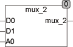
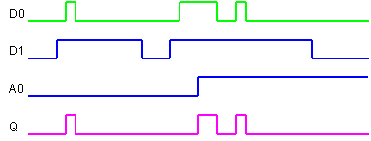

<!--
  Copyright (c) 2026 Hans Mühlbauer, Franz Höpfinger and others.

  This program and the accompanying materials are made available under the
  terms of the Eclipse Public License 2.0 which is available at
  https://www.eclipse.org/legal/epl-2.0

  SPDX-License-Identifier: EPL-2.0
-->

## MUX_2

| | |
|:---|:---|
| **Type	Function** | BOOL |
| **Input	D0** | BOOL (Bit 0) |
| **D1** | BOOL (Bit 1) |
| **A0** | BOOL (address) |
| **Output** | BOOL (D0, when A0 = 0 and D1, when A0 = 1) |
| | MUX_2 is a 2-bit  Multiplexer.  The output corresponds to D0 when A0 = 0 and it corresponds to D1, if A0 = 1 |
| **Logical connection** | MUX_2 = D0 & /A0 + D1 & A0 |

