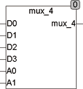
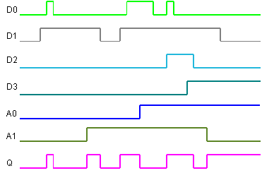

<!--
  Copyright (c) 2026 Hans Mühlbauer, Franz Höpfinger and others.

  This program and the accompanying materials are made available under the
  terms of the Eclipse Public License 2.0 which is available at
  https://www.eclipse.org/legal/epl-2.0

  SPDX-License-Identifier: EPL-2.0
-->

## MUX_4

| | |
|:---|:---|
| **Type	Function** | BOOL |
| **Input	D0** | BOOL (input 0) |
| **D1** | BOOL (input 1) |
| **D2** | BOOL (input 2) |
| **D3** | BOOL (Input 3) |
| **Output** | BOOL (D0, if A0 = 0 and A1 = 0, etc. ..) |
| | MUX_4 is a 4-bit  Multiplexer.  The output corresponds to D0 when A0 = 0 and A1 = 0 It corresponds to D3, if A0 = 1 and A1 = 1. |
| **Logical connection** | MUX_4  = 	D0 & /A0 & /A1 + D1 & A0 & /A1 |
| | + D2 & /A0 & A1 + D3 & A0 & A1 |

