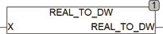

<!--
  Copyright (c) 2026 Hans Mühlbauer, Franz Höpfinger and others.

  This program and the accompanying materials are made available under the
  terms of the Eclipse Public License 2.0 which is available at
  https://www.eclipse.org/legal/epl-2.0

  SPDX-License-Identifier: EPL-2.0
-->

## REAL_TO_DW

| | |
|:---|:---|
| **Type	Function** | DWORD |
| **Input	IN** | REAL (input) |
| **Output** | DWORD (output value) |
| | REAL_TO_DW copies the bit pattern of a REAL (IN) in a DWORD. These bits are copied without regard to their meaning. The function REAL_TO_DW is the inverse so that the conversion of REAL_TO_DW and then DW_TO_REAL result in the output value. The IEC standard function REAL_TO_DWORD converts the REAL value to a fixed numerical value and is rounded at the lowest point of the DWORD. |

