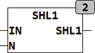

<!--
  Copyright (c) 2026 Hans Mühlbauer, Franz Höpfinger and others.

  This program and the accompanying materials are made available under the
  terms of the Eclipse Public License 2.0 which is available at
  https://www.eclipse.org/legal/epl-2.0

  SPDX-License-Identifier: EPL-2.0
-->

## Type	Function: DWORD

| | |
|:---|:---|
| **Input	IN** | DWORD (input data) |
| **N** | INT (number of bits to be shifted) |
| **Output** | DWORD (Result) |
| | SHL1 shifts the input DWORD for N bits to the left and fills the right N bits with 1. In contrast to the IEC standard function SHL, which filles when pushing  with zeros, at SHL1 is filled with ones. |



**Example:**

```iecst
SHL1(11110000,2) results 11000011
```
