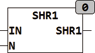

<!--
  Copyright (c) 2026 Hans Mühlbauer, Franz Höpfinger and others.

  This program and the accompanying materials are made available under the
  terms of the Eclipse Public License 2.0 which is available at
  https://www.eclipse.org/legal/epl-2.0

  SPDX-License-Identifier: EPL-2.0
-->

## Type	Function: DWORD

| | |
|:---|:---|
| **Input	IN** | DWORD (input data) |
| **N** | INT (number of bits to be shifted) |
| **Output** | DWORD (Result) |
| | SHR1 pushes the input to N bits to the right and fills the left N bits with 1's. In contrast to the IEC standard function SHL, which filles when pushing  with zeros, at SHR1 is filled with ones. |



**Example:**

```iecst
SHR1(11110000,2) results 11111100
```
