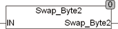

<!--
  Copyright (c) 2026 Hans Mühlbauer, Franz Höpfinger and others.

  This program and the accompanying materials are made available under the
  terms of the Eclipse Public License 2.0 which is available at
  https://www.eclipse.org/legal/epl-2.0

  SPDX-License-Identifier: EPL-2.0
-->

## Type	Function: DWORD

| | |
|:---|:---|
| **Input	IN** | DWORD (input data) |
| **Output** | DWORD (Result) |
| | SWAP_BYTE2 reverses the order of bytes in a DWORD. |



**Example:**

```iecst
SWAP_BYTE2(16#33df1122) = 16#2211df33.
```
