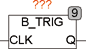

<!--
  Copyright (c) 2026 Hans Mühlbauer, Franz Höpfinger and others.

  This program and the accompanying materials are made available under the
  terms of the Eclipse Public License 2.0 which is available at
  https://www.eclipse.org/legal/epl-2.0

  SPDX-License-Identifier: EPL-2.0
-->

## Type	Function module

| | |
|:---|:---|
| **Input	CLK** | BOOL (Input signal) |
| **Output	Q** | BOOL (output) |
| | The function module B_TRIG generates after a change of edge on the CLK input an output pulse for exactly one PLC cycle. In contrast to the two standard modules  R_TRIG and F_TRIG that produce only at falling or rising edge of a pulse, B_TRIG generates at falling and rising edge of an output pulse. |

