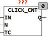

<!--
  Copyright (c) 2026 Hans Mühlbauer, Franz Höpfinger and others.

  This program and the accompanying materials are made available under the
  terms of the Eclipse Public License 2.0 which is available at
  https://www.eclipse.org/legal/epl-2.0

  SPDX-License-Identifier: EPL-2.0
-->

## Type	Function module

| | |
|:---|:---|
| **Input	IN** | BOOL (Input) |
| **N** | INT (number ofclicks ) to decode |
| **TC** | TIME (time in which the clicks must take place) |
| **Output	Q** | BOOL (output) |
| | CLICK_CNT determines the number  of pulses  within the unit time TC. at input IN. A rising edge at IN will start an internal timer with time TC. During the course of Timers the module counts the falling edges of IN and reviewes after the expiry of the time TC whether N pulses are within the time TC. Just when exactly N pluses within TC will happen, the output Q is set for a PLC cycle to TRUE. The module decodes also N = 0, which corresponds to a rising edge but not falling edge within TC. |

