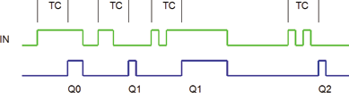

<!--
  Copyright (c) 2026 Hans Mühlbauer, Franz Höpfinger and others.

  This program and the accompanying materials are made available under the
  terms of the Eclipse Public License 2.0 which is available at
  https://www.eclipse.org/legal/epl-2.0

  SPDX-License-Identifier: EPL-2.0
-->

## Type	Function module

| | |
|:---|:---|
| **Input	IN** | BOOL (Input) |
| **TC** | TIME (time in which the clicks must take place) |
| **Output	Q0** | BOOL (output signal rising edge |
| | without falling edge) |
| **Q1** | BOOL (output signal of a pulse within TC) |
| **Q2** | BOOL (output signal for two pulses within TC) |
| **Q3** | BOOL (output signal for three pulses within TC) |
| | CLICK_DEC decodes multiple keystrokes and signals to different outputs the number of pulses. An input signal without falling edge within TC is issued at Q0 and remains TRUE until IN goes on FALSE. A pulse followed by a TRUE is output to Q1 and so on. Is a pulse registered within TC which is followed by the state FALSE, then TRUE appear at the corresponding output for a PLC cycle. |

