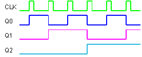
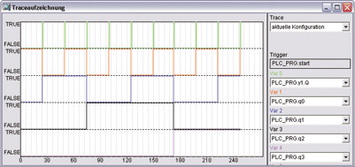

<!--
  Copyright (c) 2026 Hans Mühlbauer, Franz Höpfinger and others.

  This program and the accompanying materials are made available under the
  terms of the Eclipse Public License 2.0 which is available at
  https://www.eclipse.org/legal/epl-2.0

  SPDX-License-Identifier: EPL-2.0
-->

## Type	Function module

| | |
|:---|:---|
| **Input	CLK** | BOOL (  Clock Input) |
| **RST** | BOOL (Reset input) |
| **Output	Q0** | BOOL (divider output CLK / 2) |
| **Q1** | BOOL (divider output CLK / 4) |
| **Q2** | BOOL (divider output CLK / 8) |
| **Q3** | BOOL (divider output CLK / 16) |
| **Q4** | BOOL (divider output CLK / 32) |
| **Q5** | BOOL (divider output CLK / 64) |
| **Q6** | BOOL (divider output CLK / 128) |
| **Q7** | BOOL (divider output CLK / 256) |
| | The function module CLK_DIV is a divider module and devides the input signal CLK into 8 levels each divided by 2, so that at the output Q0 is half the frequency of the input CLK with 50% duty cycle available. The output Q1 is the halved frequency of Q0 available and so on, until at Q7 the input frequency is divided by 256. A reset input RST sets asynchronous all outputs to FALSE. CLK is allowed to make only one cycle to TRUE, if CLK does not this,  CLK musst provided over TP_R. |
| **The following example is a test circuit with a start signal via ENI / ENO realized functionality. Figure 2 shows a corresponding trace recording of the circuit** |  |

