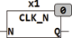

<!--
  Copyright (c) 2026 Hans Mühlbauer, Franz Höpfinger and others.

  This program and the accompanying materials are made available under the
  terms of the Eclipse Public License 2.0 which is available at
  https://www.eclipse.org/legal/epl-2.0

  SPDX-License-Identifier: EPL-2.0
-->

## Type	Function module

| | |
|:---|:---|
| **Input	N** | INT (  Clock Divider) |
| **Output	Q** | BOOL (clock output) |
| | CLK_N generates a pulse every X milliseconds, based on the PLC internal 1 ms reference. The pulses are exactly one PLC cycle length and are generated every 2^N milliseconds. |
| | The period is 1 ms for N = 0, 2ms for N = 1, 4ms, for N=2 |
| | CLK_N replaces the modules CLK_1ms, CLK_2ms, CLK_4ms and CLK_8ms from older libraries. |
| **The following picture shows the output signal for N=0** |  |

