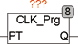

<!--
  Copyright (c) 2026 Hans Mühlbauer, Franz Höpfinger and others.

  This program and the accompanying materials are made available under the
  terms of the Eclipse Public License 2.0 which is available at
  https://www.eclipse.org/legal/epl-2.0

  SPDX-License-Identifier: EPL-2.0
-->

## Type	Function module

| | |
|:---|:---|
| **Input	PT** | TIME (cycle time) |
| **Output	Q** | BOOL (clock output) |
| | CLK_PRG generates clock pulses with a programmable period PT. The output pulses are only one PLC cycle. |

