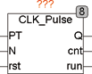

<!--
  Copyright (c) 2026 Hans Mühlbauer, Franz Höpfinger and others.

  This program and the accompanying materials are made available under the
  terms of the Eclipse Public License 2.0 which is available at
  https://www.eclipse.org/legal/epl-2.0

  SPDX-License-Identifier: EPL-2.0
-->

## Type	Function module

| | |
|:---|:---|
| **Input	PT** | TIME (cycle time) |
| **N** | INT (number of pulses to be generated) |
| **RST** | BOOL (Reset) |
| **Output	Q** | BOOL (clock output) |
| **CNT** | INT (counter of output pulses) |
| **RUN** | BOOL (TRUE, if pulse generator is running) |
| | CLK_PULSE generates a defined number of clock pulses with a programmable duty cycle. PT defines the duty cycle and N is the number of generated pulses. WIth a reset input RST, the generator can be restarted at any time. The output CNT counts the pulses generated and RUN = TRUE indicates that the generator currently generate pulses. An input value N = 0 generates an infinite pulse series, the maximum number of pulses is limited to 32767. |
| | The following example shows an application of CLK_PULSE for the production of 7 pulses with a duty cycle of 100 ms. |
| | The  trace  recording, shows how the RESET (green) is inactive and thus RUN (red) is active. The generator generates then 7 pulses (blue), as specified at the input N. The output CNT counts from 1 on the first pulse to 7 by the last pulse. After the end of the sequence RUN is inactive again and the cycle is complete until it is started by a new reset. |

