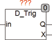
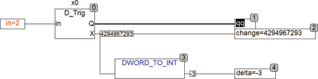

<!--
  Copyright (c) 2026 Hans Mühlbauer, Franz Höpfinger and others.

  This program and the accompanying materials are made available under the
  terms of the Eclipse Public License 2.0 which is available at
  https://www.eclipse.org/legal/epl-2.0

  SPDX-License-Identifier: EPL-2.0
-->

## Type	Function module

| | |
|:---|:---|
| **Input	IN** | DWORD (input signal) |
| **Output	Q** | BOOL (output) |
| **X** | DWORD (change of the input signal) |
| | The function module  D_  TRIG generates after a change at the input IN an output pulse for exactly one PLC cycle. The module works similar to the standard function blocks  R_TRIG and F_TRIG and the library module B_TRIG. While B_TRIG, R_TRIG and F_TRIG monitor a Boolean input, the module D_TRIG triggers on any change in the DWORD-input IN. If the input value has changed, the output Q for a PLC cycle is set to TRUE and the output X indicates how much has changed in the IN input. The input and output are of type DWORD. The input can also process WORD and BYTE types. With output X it should be noted that DWORD is unsigned and therefore a change of -1 at the input is not -1, but the number 2^32-2 at the output. With the standard function DWORD_TO_INT the output X can be converted to an integer, which displays also negative changes correctly. |
| **The following example shows the application of D_TRIG when the input changes value from 5 to 2** |  |

