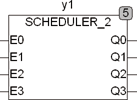

<!--
  Copyright (c) 2026 Hans Mühlbauer, Franz Höpfinger and others.

  This program and the accompanying materials are made available under the
  terms of the Eclipse Public License 2.0 which is available at
  https://www.eclipse.org/legal/epl-2.0

  SPDX-License-Identifier: EPL-2.0
-->

## Type	Function module

| | |
|:---|:---|
| **Input	E0..3** | BOOL (release signal for Q0..3) |
| **Output	Q0..3** | BOOL (output signals) |
| | SCHEDULER_2 activates depending on the setup variables C? And O? The outputs Q?. SCHEDULER_2 can an output Q? All C? cycles enable, to launch the program items with different cycle times. An optional setup parameters O? is used to a time offset of O? to define cycles for the corresponding output to a simultaneous turn of the outputs in the first cycle to prevent. |
| **Setup	C0 .. 3** | UINT (The output Q? is activated the C? cycles) |
| **O0 .. 3** | UINT (delay for the outputs) |

